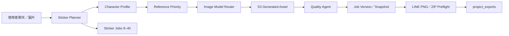

# 第二階段 Agent 架構

Sticker Muse 採用「表面單一聊天框、內部可持久化工作流」的架構。前端 `Home.tsx` 處理聊天、素材、狀態與貨架；tRPC router 管理規劃、生成、品質、保存與回復；MySQL 保存可查詢 metadata；S3 保存影像與 ZIP bytes。

| 階段 | 核心狀態 | 中斷處理 |
| --- | --- | --- |
| 分析／規劃 | `character_profiles`、`sticker_plans`、snapshot | 不破壞已完成 job |
| 逐張生成 | `sticker_jobs`：pending／generating／completed／failed／retrying | 失敗與 quota 會保存 error；resume 只挑未完成位置 |
| 版本修改 | `sticker_job_versions`、`currentAssetId` | 回復只更新目標 job pointer |
| 匯出 | `project_exports` + S3 ZIP | 已通過檢查的 ZIP 可重新下載 |

此架構避免把「一次大批量生成」做成不可恢復的黑箱。每張貼圖是獨立 job，但共享角色設定、確認的 anchor、風格規則與套組規劃。
